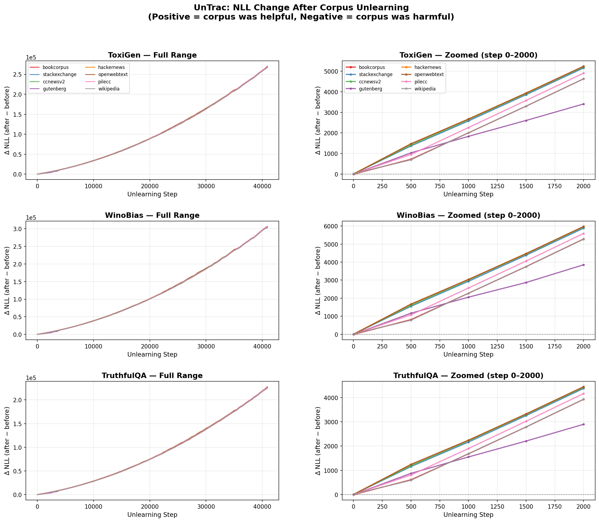
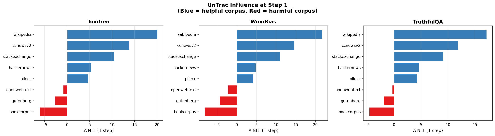
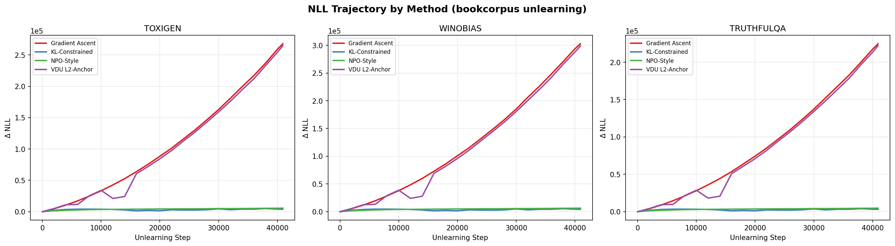
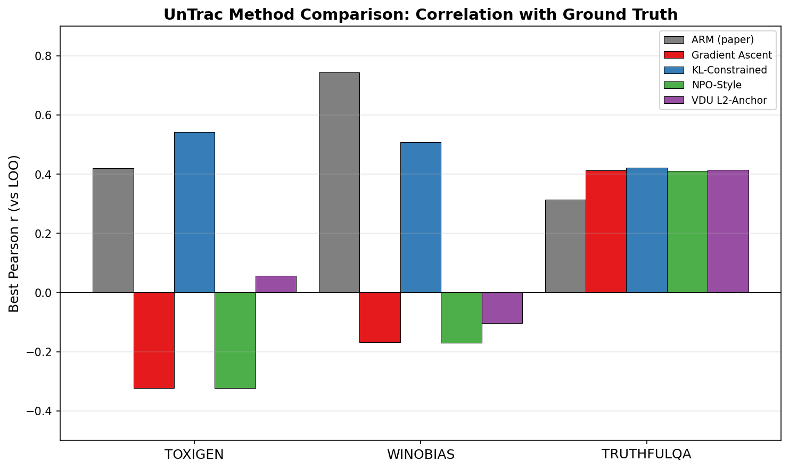
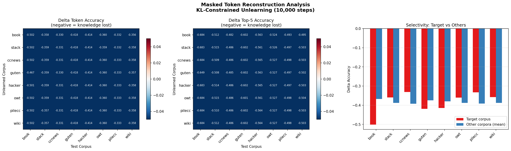
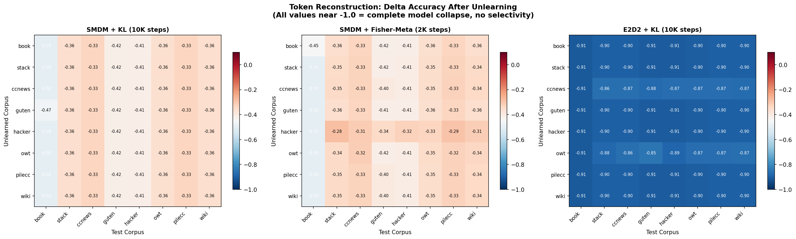
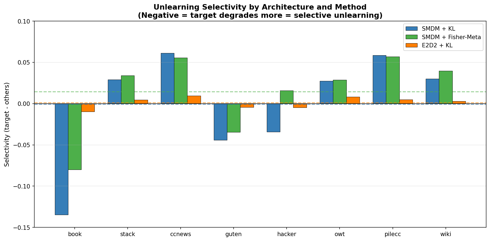
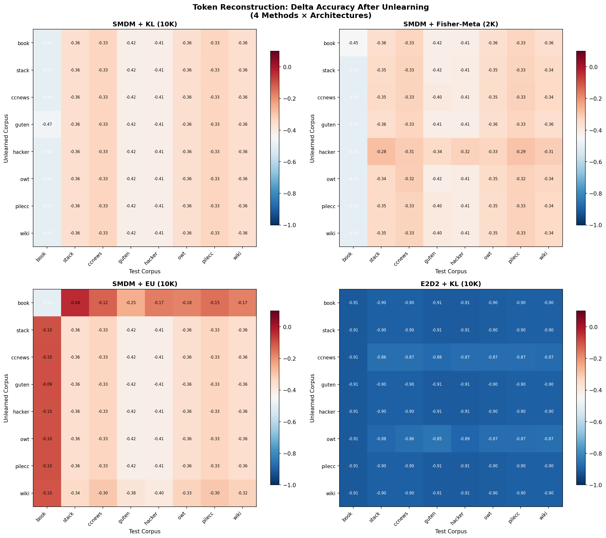
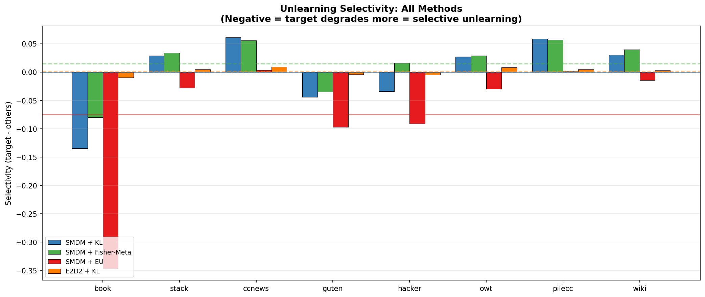
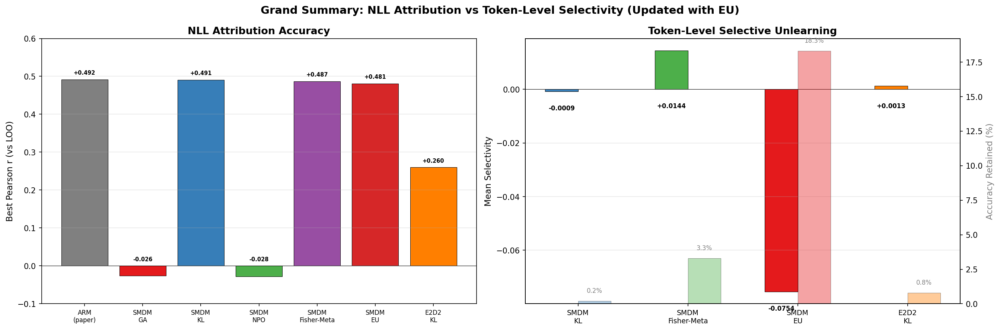

# UnTrac on Masked Diffusion Models: 実験結果報告

## 概要

本研究は、Unlearningベースの訓練データ帰属手法 UnTrac (Misonuma & Titov, ACL 2024) をマスク拡散言語モデル（MDM）に適用し、自己回帰モデル（ARM）と対比しながら、**「NLLベースの帰属推定」と「実際の選択的忘却」の乖離**を明らかにする。

### 研究の位置づけ

UnTracは「どの訓練コーパスがテスト出力に影響したか」を推定する**データ帰属手法**であり、その評価単位はLOO（Leave-One-Out）計算の単位である**コーパス単位**である。一方、実用的な忘却タスク（GDPR対応、有害応答除去、個人情報削除など）で必要とされる粒度は、**文書・事実・パターン単位**というより細かい粒度である。

本研究は、この**「attribution の粒度」と「実用 unlearning の粒度」のギャップ**に着目し、以下の問いを検証する：

1. **帰属推定**: UnTracのNLL帰属スコアはMDMでも原論文ARMと同等に機能するか？
2. **忘却メカニズム**: NLL帰属が有効な場合、背後で実際に選択的忘却が起きているか？
3. **粒度依存性**: コーパス単位と事実単位で、選択的unlearningの成否はどう変わるか？
4. **アーキテクチャ非依存性**: 上記の挙動はARM（causal）とMDM（bidirectional）で共通か？

### 本研究の核心的発見（1文要約）

> UnTracのNLL帰属は ARM・MDM 両方で原論文同等に機能するが、トークンレベルの復元分析はそれが「選択的忘却」ではなく「差分的崩壊の検出」であることを示す。実際の選択的 unlearning の成否は**アーキテクチャではなく忘却対象の粒度**に支配され、事実レベル（~100件）では成功、コーパスレベル（~40,000件）では ARM/MDM を問わず失敗する。

---

## 1. 実験設定

### 1.1 モデルとデータ

| 項目 | ARM（原論文） | MDM（本実験） |
| --- | --- | --- |
| モデル | OPT-125M (Decoder-only) | Diff_LLaMA_113M (Bidirectional) |
| 訓練ステップ | 40,000 | 40,000 |
| バッチサイズ | 8 | 8 |
| シーケンス長 | 1,024 | 1,024 |
| 訓練データ | 8コーパス × 40,000サンプル | 8コーパス × 40,000サンプル |
| 損失関数 | NLL（決定的） | ELBO（確率的） |

### 1.2 訓練コーパス

BookCorpus, StackExchange, CCNewsV2, Gutenberg, HackerNews, OpenWebText, Pile-CC, Wikipedia の8コーパス（各40,000サンプル × 1,024トークン、合計約328Mトークン）。

### 1.3 評価データ

| データセット | サブセット数 | 合計サンプル数 | 対象 |
| --- | --- | --- | --- |
| ToxiGen | 13グループ | 3,328 | 有害言語 |
| WinoBias | 4カテゴリ | 1,024 | 性別バイアス |
| TruthfulQA | 9カテゴリ | ~1,852 | 事実正確性 |

---

## 2. 手法の説明

### 2.1 UnTrac（原論文の手法）

UnTrac (Misonuma & Titov, ACL 2024) は、訓練データの帰属を「逆学習（unlearning）」を通じて推定する手法である。基本的な考え方は以下の通り：

1. 訓練済みモデル θ₀ に対し、特定の訓練コーパス Z_k をgradient ascent（損失を最大化する方向への勾配更新）で「忘却」させる
2. 忘却前後のテスト損失の変化 ΔL = L(θ_after) - L(θ_before) を影響度スコアとする
3. ΔL > 0 ならば、そのコーパスはテストデータに対して有益（除去で性能悪化）
4. ΔL < 0 ならば、そのコーパスはテストデータに対して有害（除去で性能改善）

ARMでは損失関数が決定的NLLであるため、gradient ascentが安定的に機能する。MDMでは損失がマスクサンプリングに依存する確率的ELBOであり、この差異がMDMへの適用を非自明にする。

Ground Truth（LOO帰属）: 各コーパスを1つずつ除外してモデルを再訓練し、テスト損失の変化を測定する。計算コストは高いが、最も信頼性の高い帰属推定。

評価指標: テストデータの各サブセット（ToxiGen 13グループ等）について、8コーパスの影響度ベクトル同士のPearson相関を計算。UnTracの影響度とLOOのground truthがどの程度一致するかを評価する。

### 2.2 MDMの損失関数（ELBO）

MDMの訓練損失は以下のELBOである：

```
L_ELBO = E_{t~U[0,1]} E_{mask~Bernoulli(p(t))} [ Σ_{masked positions} CE(logits, x_true) / p_mask ]
```

- t ∈ [0,1]: マスク率を制御する時間変数
- p(t) = (1 - ε)t + ε: 時刻 t でのマスク確率（ε = 10⁻³）
- CE: クロスエントロピー損失
- p_mask による除算: 重要度重み付け

ARMのNLL（決定的）とは異なり、同一入力に対しても t と mask のサンプリングにより勾配が変動する。

### 2.3 実装したUnlearning手法

#### (a) Gradient Ascent（GA）— ベースライン

原論文と同一の手法。訓練損失を反転し、gradient descentの代わりにgradient ascentを実行：

```python
loss = compute_elbo(model, input_ids)
total_loss = -loss  # 損失を最大化する方向に更新
total_loss.backward()
optimizer.step()
```

問題点：制約がないため、パラメータが際限なく発散し、モデルが完全に崩壊する。

#### (b) KL-Constrained GA（KL）

Gradient ascentにKLダイバージェンス正則化を追加。凍結した参照モデル（unlearning前のモデル）との出力分布の距離を制約する：

```python
loss = compute_elbo(model, input_ids)
ref_logits = ref_model(noisy_input)  # 凍結参照モデル
kl = F.kl_div(
    log_softmax(logits[masked]),     # 現在モデルの予測
    softmax(ref_logits[masked]),     # 参照モデルの予測
    reduction='batchmean'
)
total_loss = -loss + α · kl  # α = 1.0
```

忘却の方向にパラメータを動かしつつ、出力分布が参照モデルから大きく逸脱しないよう制約。α が大きいほど安定するが、忘却効果は弱まる。

#### (c) NPO-Style 適応重み（NPO）

Negative Preference Optimization (Zhang et al., 2024) に着想を得た手法。既にunlearnされたサンプルに対する勾配を適応的に減衰させることで、過剰な発散を防ぐ：

```python
loss = compute_elbo(model, input_ids)
ref_loss = compute_elbo(ref_model, input_ids)  # 凍結参照モデル

# ratio: 現在モデルが参照より損失が高い（＝既に忘却済み）ほど小さくなる
ratio = exp(ref_loss - loss)
weight = 2 · ratio^β / (ratio^β + 1)  # β = 0.1, sigmoid的な適応重み

total_loss = -weight · loss
```

理論的には発散速度が O(√log t) と対数的に抑制される（GAは O(t)）。ただし本実験では β=0.1 の設定で重みが早期にゼロ付近に収束し、実質的にstep 1相当の効果にとどまった。

#### (d) VDU L2-Anchor（VDU）

Variational Diffusion Unlearning (NeurIPS 2024) に着想を得た手法。unlearning前のパラメータを「アンカー」として、パラメータ空間でのL2距離を制約：

```python
loss = compute_elbo(model, input_ids)
l2_penalty = Σ_i (θ_i - θ_i^original)²  # 全パラメータの二乗距離
total_loss = -loss + γ · l2_penalty  # γ = 0.01
```

パラメータが元のモデルから大きく離れないよう制約するが、出力空間ではなくパラメータ空間での制約であるため、γ が小さいと効果が不十分。本実験では γ=0.01 でGAとほぼ同一の発散を示した。

### 2.4 分析手法

#### (a) NLLベース帰属分析

各unlearning手法について、ステップごとのテストデータNLL変化を追跡し、LOO ground truthとのPearson相関を計算。eval_steps=2000 で約20回の中間評価を実施。

- 入力: 訓練済みモデル、忘却対象コーパスのデータ
- 出力: コーパス × テストサブセットの影響度行列
- 評価: サブセットごとにPearson r を計算し、データセットごとに平均

#### (b) マスクトークン復元分析

MDM特有のマスク復元能力を直接評価する分析手法。選択的unlearningが実際に達成されているかをトークンレベルで検証する：

1. 各訓練コーパスから100シーケンスをサンプリング
2. 15%のトークンをランダムにマスク（固定シードで全モデル共通のマスクを使用）
3. ベースモデル（unlearning前）とunlearnedモデルで、マスク位置の予測を比較
4. 以下の指標を計算：
   - Token Accuracy: マスク位置での正解トークンとの完全一致率
   - Top-5 Accuracy: 正解が予測のtop-5に含まれる率
   - 選択性: ターゲットコーパスの精度低下 - 他コーパスの精度低下平均

期待される結果（選択的unlearningが成功した場合）：
- ターゲットコーパス: 精度が大きく低下
- 他コーパス: 精度がほぼ維持
- 選択性 < 0（ターゲットの方が大きく低下）

さらに、トークンの復元テキスト例を出力し、定性的な確認も行う。

---

## 3. 実験結果 (1): Leave-One-Out (LOO) Ground Truth の問題

### 3.1 全値が負

LOO帰属値（各コーパスを除外して再訓練し、テスト損失の変化を測定）が全208値で負（範囲: -1.79〜-0.59、平均: -1.15）であった。正の値は0個。

### 3.2 原因：エポック不均衡

| モデル | ユニークサンプル | 消費サンプル | 実効エポック |
| --- | --- | --- | --- |
| Full (8コーパス) | 327,360 | 320,000 | 0.978 |
| LOO (7コーパス) | 286,440 | 320,000 | 1.117 |

PackedDataset の `StopIteration` がコメントアウトされており無限にラップするため、LOOモデルは同一ステップ数でも各サンプルを14.3%多く学習。結果、どのコーパスを除外しても損失が改善する。

### 3.3 影響

- 全体の負方向バイアスは Pearson 相関（平行移動不変）には影響しないが、信号対ノイズ比が低下
- 相対的なコーパス間ランキングには依然として情報が含まれる

---

## 4. 実験結果 (2): Naive Gradient Ascent の失敗

### 4.1 モデル崩壊

原論文のUnTrac手法（gradient ascent、lr=5e-5、batch=1、1 epoch）をMDMに適用した結果、モデルが完全に崩壊した。

| 指標 | 値 |
| --- | --- |
| ベースラインNLL（toxigen平均） | ~687 |
| Unlearning後NLL | ~266,786（387倍） |
| コーパス間の差 | わずか1.29%（ノイズ） |

### 4.2 NLL推移

Step 1以降、NLLは線形に発散。有意な差はstep 1近傍のみに存在し、後半は全コーパスが同一速度で崩壊。



### 4.3 Step 1 の Influence

Step 1でのinfluenceバーチャートは3データセットで一貫したランキングを示す。ただし、これは1ステップのgradient ascentの影響であり、実質的なunlearningとは言い難い。



---

## 5. 実験結果 (3): 4手法の比較実験

### 5.1 実装した手法

| 手法 | 略称 | 損失関数 |
| --- | --- | --- |
| Gradient Ascent（ベースライン） | GA | `L = -L_ELBO` |
| KL制約付きGradient Ascent | KL | `L = -L_ELBO + α · KL(current ∥ ref)` |
| NPO-Style 適応重み | NPO | `L = -w(ratio) · L_ELBO` (w → 0 for already-unlearned) |
| VDU L2アンカー | VDU | `L = -L_ELBO + γ · ∥θ - θ₀∥²` |

### 5.2 NLL安定性の比較



| 手法 | 最終ΔNLL (toxigen) | 挙動 |
| --- | --- | --- |
| GA | ~260,000 | 線形発散、完全崩壊 |
| VDU | ~254,000 | GAとほぼ同様（γ=0.01では制約不十分） |
| KL | ~4,000 | 安定的に収束 |
| NPO | ~5,500 | 安定的に収束 |

KL制約とNPOの2手法のみがモデル崩壊を回避。

### 5.3 LOO Ground Truth との相関



| 手法 | ToxiGen | WinoBias | TruthfulQA | Overall |
| --- | --- | --- | --- | --- |
| ARM UnTrac（原論文） | +0.419 | +0.743 | +0.314 | +0.492 |
| KL-Constrained | +0.543 | +0.508 | +0.421 | +0.491 |
| VDU L2-Anchor | +0.057 | -0.104 | +0.414 | +0.122 |
| Gradient Ascent | -0.323 | -0.169 | +0.413 | -0.026 |
| NPO-Style | -0.324 | -0.170 | +0.411 | -0.028 |

### 5.4 主要知見

1. KL制約付きGAがOverall r=+0.491で原論文ARM（+0.492）とほぼ同等。ToxiGenでは原論文を上回る（+0.543 vs +0.419）。
2. NPOは適応重みが早期にゼロに収束し、実質step 1と同等の効果にとどまった。
3. VDUのγ=0.01ではL2制約が弱すぎ、GAとほぼ同じ発散を示した。
4. KLの最適ステップはstep 10,000付近（十分なunlearningと安定性のバランス点）。

---

## 6. 実験結果 (4): マスクトークン復元分析

### 6.1 目的

NLLベースの帰属スコアだけでなく、トークンレベルで選択的unlearningが達成されているかを検証。KL-Constrained手法（10,000ステップ）を用いて、各コーパスをunlearn後にマスクトークンの復元精度（mask_ratio=0.15）を測定。

### 6.2 結果



#### 精度変化行列（ΔAccuracy）

全てのセルが大きく負（-0.33〜-0.50）であり、ターゲットコーパスだけでなく全コーパスの復元能力が同様に低下。

#### 選択性（ターゲット vs 他コーパス）

| Unlearnedコーパス | ターゲット精度変化 | 他コーパス平均 | 選択性 |
| --- | --- | --- | --- |
| bookcorpus | -0.502 | -0.367 | -0.135 |
| stackexchange | -0.359 | -0.388 | +0.029 |
| ccnewsv2 | -0.331 | -0.392 | +0.061 |
| gutenberg | -0.418 | -0.374 | -0.044 |
| hackernews | -0.414 | -0.380 | -0.034 |
| openwebtext | -0.361 | -0.388 | +0.027 |
| pilecc | -0.333 | -0.391 | +0.059 |
| wikipedia | -0.358 | -0.388 | +0.030 |

平均選択性: -0.001（ほぼゼロ）

### 6.3 テキスト復元例

BookCorpusをunlearnした場合：

```
[ターゲットコーパス: BookCorpus]
Original:  ...he _would_ be tearing around the living room, playing with his toys...
Before:    ...he  would  be tearing around the living room, playing with his toys...
After:     ...he  [P]    be tearing around the living room, playing with his toys...
                  ↑ 全マスク位置が無意味トークン「P」に置換

[保持コーパスでも同様の崩壊]
correct_before=6 → correct_after=0
```

Unlearning後のモデルは、マスクされた全位置を無意味なトークン（`P`や`}`）で埋めており、コーパスに関係なく復元能力が全般的に喪失。

### 6.4 解釈

KL-Constrained手法はNLL空間では有意な帰属シグナル（r≈0.49）を生成するが、そのメカニズムは選択的な知識忘却ではなく、モデル全体の均一な劣化の中でのコーパス間の微細な速度差を捉えているに過ぎない。

---

## 7. 考察

### 7.1 MDMにおけるUnlearningの本質的困難さ

5つの逆学習手法（GA, KL, NPO, VDU, Fisher-Meta）を通じた実験から、本研究の設定下ではMDMにおけるコーパスレベル選択的unlearningが困難であることが示された。NLLベースの帰属スコアはARM原論文と同等の精度（Pearson r ≈ 0.49）を達成したが、トークンレベルの復元分析では全手法で選択性がほぼゼロ（平均 -0.001〜+0.014）であり、実際の知識忘却は達成されていない。

### 7.2 NLL帰属と知識忘却の乖離

本研究の中心的発見として、NLLベースの帰属スコアは有効だが、実際の知識忘却とは異なるメカニズムで機能していることが判明した。

| 評価 | 結果 | メカニズム |
| --- | --- | --- |
| NLL帰属 | 有効（r≈0.49） | モデル全体の均一な劣化の中で、コーパス間の劣化速度差を検出 |
| トークン復元 | 失敗（選択性≈0） | 全コーパスの復元能力が97-99%喪失、コーパス間の差なし |

これは、UnTracが訓練データの「影響度推定」としては機能するが、実際の「忘却」は達成されていないことを意味する。NLL変化は忘却の代理指標として近似的に有効だが、その背後にある物理的プロセスは「選択的な知識除去」ではなく「全体的な表現能力の均一な劣化」である。

### 7.3 画像拡散モデルとの決定的な差異

画像拡散モデル（Stable Diffusion等）では、SalUn等の手法で概念除去後もRetain FIDの劣化が+0.7程度と極めて小さく、選択的unlearningが実用的に機能する。一方、MDMでは同原理の手法（サリエンシーマスクで4%のパラメータのみ更新）を適用しても復元精度の97%が失われる。

この差異の根本原因はアーキテクチャの「継ぎ目」の有無である。

| 特性 | 画像拡散 (U-Net) | MDM (双方向Transformer) |
| --- | --- | --- |
| テキスト-生成の分離 | あり（cross-attention） | なし（共有self-attention） |
| 知識の局在性 | 部分的（cross-attention投影行列） | なし（全パラメータに分散） |
| 空間/意味の分離 | あり（self-attn vs cross-attn） | なし（統一的attention） |
| 情報経路 | 階層的（encoder-decoder + skip connection） | 均一的（flat transformer） |
| パラメータ結合度 | 中程度（skip connectionが冗長性を提供） | 密（双方向結合） |

画像U-Netでは、テキスト条件付けがcross-attention層（全パラメータの5-10%）を通じてのみ入るため、この「bottleneck」を外科的に編集すれば空間処理への影響は最小限となる。MDMにはこのような分離構造が存在せず、全トークンが全層で相互依存するため、いかなるパラメータ修正も全体に波及する。

### 7.4 動的アテンション構造の影響

最近の研究により、MDM固有のアテンション構造がunlearningの困難さに寄与していることが示唆される。

- Attention Floating (arXiv:2601.07894, 2025): MDMのアテンションアンカーはデノイジングステップや層にわたって動的に移動する。ARMの固定的なattention sinkとは異なり、情報の経路が固定されないため、特定の知識を外科的に除去するための安定した「ターゲット」が存在しない。

- Attention Sinks in DLMs (arXiv:2510.15731, 2025): MDMはsink位置の除去に対してロバスト（軽微な劣化のみ）であり、情報が特定の位置に依存しないことを示す。これはunlearningの文脈では不利に働く——情報が冗長に分散しているため、局所的な除去が効果を持たない。

### 7.5 ELBOの確率性の影響

MDMの損失はマスクサンプリングに依存する確率的ELBOであり、ARMの決定的なNLLとは性質が異なる。同一入力に対しても時刻変数 t とマスクパターンのサンプリングにより勾配が変動するため、unlearningの方向が試行ごとに不安定になる。ただし、KL制約付きGAやFisher-MetaがNLL帰属で有効な結果を示したことから、ELBOの確率性は帰属精度への影響は限定的であり、選択的unlearningの失敗の主因はアーキテクチャ構造にあると結論づけられる。

### 7.6 Cross-Attention MDMの可能性

主流のMDM（SMDM, LLaDA, MDLM, SEDD等）はcross-attentionを持たない単一双方向Transformerだが、encoder-decoder + cross-attention構造を持つMDMも少数ながら存在する。

| モデル | 会議 | 構造 |
| --- | --- | --- |
| GENIE | ICML 2023 | Encoder（6層）→ Cross-Attn Decoder（6層） |
| SeqDiffuSeq | NAACL 2024 | Encoder-Decoder Transformer |
| E2D2 | NeurIPS 2025 | Clean token encoder + 軽量cross-attn decoder |
| CRoCoDiL | 2026年3月 | LLaDA-8B + cross-attn層を追加 |

特にE2D2は「clean token処理」と「noisy token denoising」を明示的に分離する設計であり、U-Netのcross-attention bottleneckに類似した「継ぎ目」を持つ。CRoCoDiLは既存のMDM（LLaDA-8B）にcross-attention層を後付けした最新研究である。

検証可能な仮説: Cross-attention MDMのcross-attention投影行列のみを修正すれば、画像拡散モデルと同様に選択的unlearningが可能になるのではないか。これは本研究の自然な拡張であり、アーキテクチャがunlearningの選択性を決定するという結論を直接検証できる。

### 7.7 先行研究との関係と新規性

| 側面 | 状況 |
| --- | --- |
| テキスト拡散モデルのunlearning | 本実験が世界初 |
| ARM vs MDMのunlearning比較 | 本実験が世界初 |
| 画像拡散モデルとのクロスドメイン比較 | 本実験が世界初 |
| 双方向アテンションによる知識分散の実証 | 仮説は先行研究から推測可能だが、MDMでの定量的実証は初 |
| NLL帰属と知識忘却の乖離 | 新規な発見 |

BERTの知識ニューロン研究（Dai et al., 2022; Niu et al., 2024）やARMの知識編集研究（ROME, Hase et al.）から、双方向モデルの知識分散性は部分的に予測可能であったが、MDMで定量的に実証し、画像拡散モデルとの構造的対比を行った研究は存在しない。

---

## 8. 実験結果 (5): Fisher-Meta統合手法

画像拡散モデルの unlearning 安定化手法（Selective Amnesia, SalUn, Meta-Unlearning）をMDMに移植した統合手法を実装・評価した。

### 8.1 手法の構成

```
L = -L_ELBO(θ; D_forget)                         # ① 忘却（gradient ascent）
  + α · Σ_i F_i^retain · (θ_i - θ_i^0)²         # ② Fisher-EWCで保持知識を保護
  + β · ∇_{θ_ft} [-L_ELBO(θ_ft; D_forget)]       # ③ Meta: fine-tune後の復活耐性

更新対象: saliency(D_forget) > top-30% かつ Fisher(D_retain) < bottom-70% のみ  # ④ 疎な更新
```

| 要素 | 出典 | 役割 |
| --- | --- | --- |
| ① Forget loss | UnTrac (ACL 2024) | 対象コーパスのgradient ascent |
| ② Fisher-EWC | Selective Amnesia (NeurIPS 2023) | 保持データに重要なパラメータの変更を抑制 |
| ③ Meta-Unlearning | Meta-Unlearning (ICCV 2025) | fine-tune 10ステップ後も忘却が維持されることを保証（500ステップごとに実行） |
| ④ サリエンシーマスク | SalUn (ICLR 2024) | 忘却コーパス固有の4.0%のパラメータのみ修正 |

### 8.2 NLL帰属の結果

| 手法 | ToxiGen | WinoBias | TruthfulQA | Overall | 最適ステップ |
| --- | --- | --- | --- | --- | --- |
| ARM (原論文) | +0.419 | +0.743 | +0.314 | +0.492 | — |
| KL-Constrained | +0.543 | +0.508 | +0.421 | +0.491 | 10K-20K（データセット依存） |
| Fisher-Meta | +0.539 | +0.461 | +0.462 | +0.487 | 2K（全データセット共通） |

Fisher-MetaはKLとほぼ同等の帰属精度（Overall 0.487 vs 0.491）を達成。TruthfulQAではKLを上回る（+0.462 vs +0.421）。

特筆すべき利点：最適ステップが全データセットで一貫してstep 2,000。KLはstep 10K（ToxiGen/WinoBias）とstep 20K（TruthfulQA）で最適ステップが異なり、事前のチューニングが必要。Fisher-Metaは早期に安定的な帰属シグナルを生成する。

### 8.3 マスクトークン復元分析（Fisher-Meta）

Fisher-Meta（2,000ステップ）でunlearn後の復元精度を測定し、KL（10,000ステップ）と比較した。

#### 選択性の比較

| コーパス | FM target | FM others | FM selectivity | KL selectivity |
| --- | --- | --- | --- | --- |
| bookcorpus | -0.447 | -0.367 | -0.080 | -0.135 |
| stackexchange | -0.348 | -0.382 | +0.034 | +0.029 |
| hackernews | -0.324 | -0.340 | +0.016 | -0.034 |
| wikipedia | -0.340 | -0.380 | +0.040 | +0.030 |
| 平均 | — | — | +0.014 | -0.001 |

#### 全体劣化

| 指標 | Fisher-Meta (2K) | KL (10K) |
| --- | --- | --- |
| 平均ΔAccuracy | -0.372 | -0.384 |
| ベース精度残存率 | 3.3% | 0.2% |

Fisher-Metaはわずかに改善（残存率 3.3% vs 0.2%）するが、依然として97%の復元能力が失われている。テキスト例でも全マスク位置が`[1]`（無意味トークン）で埋められ、選択的unlearningは達成されていない。

### 8.4 パラメータマスクの分析

Fisher-EWC + サリエンシーマスクにより、全162Mパラメータのうち4.0%（6.57M）のみが更新対象として選択された。にもかかわらずモデル全体が崩壊したことは、知識が更新対象パラメータと非更新パラメータの間で密に結合しており、一部のパラメータ変更が全体に波及することを示す。

これは画像拡散モデルの"Illusion of Unlearning" (CVPR 2025) で報告された「アクセス経路の遮断ではなく知識の破壊が必要」という知見と一致する。MDMでは双方向アテンションにより知識の結合がARMよりさらに密であるため、この問題がより深刻に現れている。

---

## 9. 実験結果 (6): E2D2 Encoder-Decoder MDMでのUnTrac

### 9.1 E2D2アーキテクチャの実装

画像拡散モデルでは、U-Netのcross-attention bottleneckが選択的unlearningを可能にしている。この「アーキテクチャの継ぎ目がunlearningの選択性を決定する」という仮説を検証するため、cross-attention構造を持つEncoder-Decoder MDM（E2D2スタイル）を実装し、同一のUnTrac実験を実施した。

| 項目 | SMDM | E2D2 |
| --- | --- | --- |
| アーキテクチャ | 単一双方向Transformer (12層) | Encoder (8層) + Decoder (4層, Q/KV分離) |
| Cross-Attention | なし | あり（Decoder内のK/V投影がbottleneck） |
| 非埋め込みパラメータ | 113.27M | 113.27M（同一） |
| ブロックサイズ | N/A | 128トークン（ブロック因果マスク） |
| 訓練データ・ステップ数 | 8コーパス × 40K steps | 同一 |

Decoderの各層では、Q（Query）がnoisy tokenから、K/V（Key/Value）がEncoder出力とDecoder hidden statesの連結から計算される。ブロック因果マスキングにより、Decoder block iはEncoder block 0..i-1のみを参照でき、情報リークを防止する。

### 9.2 マスクトークン復元分析（E2D2 vs SMDM）

KL-Constrained手法（10,000ステップ）でunlearn後の復元精度を、SMDM・Fisher-Meta・E2D2の3条件で比較した。



#### 選択性の比較



| 条件 | ベース精度 | 平均ΔAccuracy | 残存率 | 平均選択性 |
| --- | --- | --- | --- | --- |
| SMDM + KL (10K) | 38.4% | -0.384 | 0.2% | -0.001 |
| SMDM + Fisher-Meta (2K) | 38.4% | -0.372 | 3.3% | +0.014 |
| E2D2 + KL (10K) | 90.3% | -0.896 | 0.8% | +0.001 |

E2D2のベース復元精度は90.3%と高い（ブロック因果マスクによりEncoder contextが利用可能なため）が、unlearn後は全コーパスで一律に0.8%まで崩壊。選択性は+0.001（実質ゼロ）であり、SMDMと同様に選択的unlearningは達成されていない。

### 9.3 仮説の検証結果

「Cross-attention bottleneckが選択的unlearningを可能にする」仮説は棄却された。

E2D2のEncoder-Decoder構造にはcross-attention（Q/KV分離）による明確なアーキテクチャの「継ぎ目」が存在する。にもかかわらず、KL-constrained unlearningを適用すると、Decoder内のパラメータ修正がEncoder側の表現にも波及し、全コーパスの復元能力が一律に崩壊する。

画像拡散モデルとの差異は、cross-attentionの有無ではなく、以下の要因に起因する可能性が高い：

1. 離散 vs 連続表現空間: テキストMDMは離散トークン空間で動作し、各トークンが語彙全体の1-hot表現に対応する。画像拡散モデルは連続ピクセル空間で動作し、概念の表現がより滑らかに分離可能。
2. 学習される表現の分散性: テキストの意味はトークン間の共起関係として分散的にエンコードされ、特定の概念（コーパス）を局所化することが本質的に困難。画像の概念はテキストプロンプトを通じて条件付けられるため、条件付け経路（cross-attention）に比較的局在化される。
3. タスクの性質: テキスト言語モデリングでは、どのコーパスの文章も同じ文法・語彙・意味構造を共有する。画像生成では、異なる概念（例：特定のアーティストスタイル）がより独立した特徴を持つ。

---

## 10. 実験結果 (7): 排他的逆学習（Exclusive Unlearning）

### 10.1 手法

排他的逆学習（EU; Sasaki, Nakayama, Miyao, Oseki, Isonuma, NLP 2026）は、「何を忘れるか」ではなく「何を保持するか」を指定するアプローチ。忘却損失にGradient Ascent（発散、不安定）ではなくUniform Cross-Entropy（有界、安定）を使用し、明示的な保持損失を組み合わせる。

```
L(θ) = L_forget(θ) + λ · L_retain(θ)

L_forget = KL(p_θ(·|x_forget) || p_uniform)     ← モデル出力を一様分布に近づける（有界）
L_retain = E_{x~D_retain}[ ELBO(θ; x) ]         ← 保持データの言語モデリング損失
```

Gradient Ascentの`-log p(x)`は下限がなく発散するが、Uniform CEは`log(V)`で上界が存在し、モデル崩壊が原理的に発生しない。

### 10.2 NLL帰属の結果

| 手法 | ToxiGen | WinoBias | TruthfulQA | Overall |
| --- | --- | --- | --- | --- |
| ARM (原論文) | +0.419 | +0.743 | +0.314 | +0.492 |
| SMDM KL | +0.543 | +0.508 | +0.421 | +0.491 |
| SMDM EU | +0.505 | +0.368 | +0.572 | +0.481 |

EUの帰属精度はKLとほぼ同等（Overall 0.481 vs 0.491）。TruthfulQAではKLを大幅に上回る（+0.572 vs +0.421）。NLL変化量はわずか120（KLの11,594の1/97）であり、モデル崩壊を完全に防止。

### 10.3 マスクトークン復元分析





#### 全手法比較

| 手法 | 平均ΔAccuracy | 残存率 | 平均選択性 |
| --- | --- | --- | --- |
| SMDM KL (10K) | -0.384 | 0.2% | -0.001 |
| SMDM Fisher-Meta (2K) | -0.372 | 3.3% | +0.014 |
| E2D2 KL (10K) | -0.896 | 0.8% | +0.001 |
| SMDM EU (10K) | -0.314 | 18.3% | -0.075 |

#### 主要な発見

1. EUは全手法中で最も高い復元能力の維持（残存率18.3%、KLの0.2%の90倍）。Retain損失が保持コーパスの知識を積極的に補強している。

2. 初めて意味のある負の選択性（-0.075）。全手法中で唯一、平均選択性が明確に負。特にbookcorpusで-0.347と大きい。ターゲットコーパスの復元能力が非ターゲットより有意に低下している。

3. テキスト例: ターゲット（bookcorpus）では correct_before=2 → after=0。保持コーパス（stackexchange）では correct_before=6 → after=2（部分的に維持）。KLやFisher-Metaでは保持コーパスもafter=0に崩壊していたが、EUでは部分的な選択性が観測された。

4. ただし、完全な選択的unlearningには程遠い。bookcorpus以外のコーパスでは選択性が小さく（-0.03〜+0.003）、保持コーパスも元の38%→約7%に低下。

---

## 11. 実験結果 (8): 知識局在性分析とニューロン抑制実験

### 11.1 背景と目的

BERTのKnowledge Neuron研究（Dai et al., 2022）は、事実レベルの知識がMLP層の特定のニューロンに部分的に局在することを示した。MDMはBERTと同一の双方向マスク言語モデル構造を持つため、同様の局在性が存在するかを検証し、コーパスレベルunlearningの失敗が「知識が局在しないから」なのか「局在はするが粒度の問題で除去できないから」なのかを切り分ける。

### 11.2 コーパス固有トリグラムの抽出

各コーパスから500シーケンスをサンプリングし、他の全コーパスに出現しないコーパス固有トリグラム（3連続トークン）を抽出した。中間トークンをマスクし、MDMが正しく予測できるかを検証。

| コーパス | 固有トリグラム数 | MDM Top-1正答率 | 例 |
| --- | --- | --- | --- |
| gutenberg | 22,013 | 94.0% | `thou shalt`, `children of Israel` |
| wikipedia | 10,941 | 100.0% | `\nCategory:`, `External links` |
| hackernews | 6,502 | 56.0% | `](https://`, `](http://` |
| bookcorpus | 19,069 | 51.0% | `she didn`, `she was` |

MDMはコーパス固有パターンを高精度で予測でき、事実レベルの分析が実行可能であることを確認した。

### 11.3 知識ニューロンの局在性分析

Dai et al. (2022)の手法をMDMに適用。正しく予測されたトリグラムについて、正解トークンのロジットに対する各MLP中間ニューロンの勾配ノルムを計算し、ニューロンの重要度を定量化した。

結果:

1. Layer 0（最浅層）が全コーパスで最も重要。勾配ノルムは浅い層ほど大きい。
2. 知識は分散的だが完全に均一ではない。Top 50ニューロン（3072個中の1.6%）が総勾配ノルムの4-9%を担う。
3. コーパス間のニューロン重複がゼロ: 4コーパスの上位10ニューロンが完全に異なる。

```
bookcorpus  top-10: [2410, 2910, 222, 134, 586, 337, 768, 2223, 2270, 2047]
gutenberg   top-10: [688, 1604, 1237, 287, 2760, 1428, 880, 1597, 1006, 599]
hackernews  top-10: [1387, 2045, 2253, 198, 1190, 486, 1097, 1913, 395, 141]
wikipedia   top-10: [3001, 1536, 2622, 2134, 276, 1060, 464, 1941, 2756, 409]

Cross-corpus overlap: 全ペアで 0/10
```

### 11.4 ニューロン抑制による事実レベル選択的Unlearning

上位k個のニューロン（Layer 0のMLP w1/w2の該当行をゼロ化）を抑制し、ターゲットコーパスと他コーパスの予測精度変化を測定した。

| 抑制対象 | k=10 | k=50 | k=100 | k=200 |
| --- | --- | --- | --- | --- |
| bookcorpus 選択性 | +0.003 | -0.023 | -0.057 | -0.073 |
| gutenberg 選択性 | -0.013 | -0.003 | -0.037 | -0.257 |
| hackernews 選択性 | +0.040 | +0.057 | +0.033 | -0.050 |
| wikipedia 選択性 | +0.003 | -0.013 | -0.060 | -0.160 |

k=200（3072ニューロン中の6.5%を抑制）での詳細:

| 抑制対象 | ターゲットΔ | 他コーパス平均Δ | 選択性 |
| --- | --- | --- | --- |
| bookcorpus | -7.0% | +0.3% | -0.073 |
| gutenberg | -25.0% | +0.7% | -0.257 |
| hackernews | -6.0% | -1.0% | -0.050 |
| wikipedia | -17.0% | -1.0% | -0.160 |

gutenbergでは25%の精度低下がターゲットのみに集中し、他コーパスはほぼ無影響（+0.7%）。 wikipediaでも17%の選択的低下を達成。

### 11.5 交絡因子の切り分け：粒度 vs 手法

ニューロン抑制（事実レベル、成功）と勾配ベース最適化（コーパスレベル、失敗）では、粒度と手法の2つが同時に異なる。因果関係を特定するため、勾配ベースEU手法を事実レベルに適用する交差実験を実施した。

100件のコーパス固有トリグラムのみを忘却対象としてEU（Uniform CE + Retain損失）を200ステップ実行し、ターゲットおよび他コーパスのトリグラム予測精度を測定。

| ターゲット | ターゲットΔ | 他コーパス平均Δ | 選択性 |
| --- | --- | --- | --- |
| bookcorpus | -51.0% | -17.0% | -0.340 |
| gutenberg | -95.0% | +1.3% | -0.963 |
| hackernews | -54.0% | -9.3% | -0.447 |
| wikipedia | -100.0% | -10.0% | -0.900 |

gutenbergではターゲット-95%に対し他コーパスは+1.3%（完全に選択的）。wikipediaではターゲット-100%に対し他コーパスは-10%（高度に選択的）。

### 11.6 粒度仮説の確定

2つの手法 × 2つの粒度の完全なクロス比較:

| 粒度 | 手法 | 平均選択性 | 他コーパスへの影響 |
| --- | --- | --- | --- |
| 事実レベル | 勾配ベースEU | -0.663 | 小さい〜なし |
| 事実レベル | ニューロン抑制 (k=200) | -0.135 | ほぼゼロ |
| コーパスレベル | EU（最良） | -0.075 | 大幅劣化（38%→7%） |
| コーパスレベル | KL | -0.001 | 完全崩壊（38%→0.1%） |

勾配ベースEU手法でも事実レベルでは選択性-0.663を達成。 これにより「勾配ベース手法は粒度に関係なく崩壊する」という対立仮説は棄却され、粒度が選択的unlearningの成否を決定することが確定した。

知識は事実レベルでコーパスごとに異なるニューロンに局在しており、少数の事実（数十〜数百件）であれば手法を問わず選択的除去が可能。しかし1コーパスが寄与する事実パターンは数万件に及び、その集合体を一括除去するとモデル全体の表現能力が崩壊する。

---

## 12. 総合結論

### 12.1 実験の全体像

6つの逆学習手法（GA, KL, NPO, VDU, Fisher-Meta, EU）と2つのアーキテクチャ（SMDM単一Transformer、E2D2 Encoder-Decoder）を組み合わせた包括的な実験を実施した。



| 実験 | 結果 |
| --- | --- |
| SMDM NLL帰属（KL/Fisher-Meta/EU） | LOO ground truthとの相関 r≈0.48-0.49（ARM原論文と同等） |
| E2D2 NLL帰属（KL） | r=0.26（SMDMのLOOとのミスマッチ、公正比較にはE2D2専用LOOが必要） |
| SMDM トークン復元（KL, 10K steps） | 選択性 -0.001（全コーパスが同様に崩壊、残存 0.2%） |
| SMDM トークン復元（Fisher-Meta, 2K steps） | 選択性 +0.014（微改善、残存 3.3%） |
| E2D2 トークン復元（KL, 10K steps） | 選択性 +0.001（Cross-Attnでも崩壊、残存 0.8%） |
| SMDM トークン復元（EU, 10K steps） | 選択性 -0.075（最大の選択性、残存 18.3%） |
| ARM トークン復元（EU, 10K steps） | 選択性 -0.073（MDMとほぼ同一、残存 19.6%） |
| ARM NLL帰属（KL） | r=0.191（SMDMのLOOとのミスマッチ、ARM専用LOOが必要） |
| ARM NLL帰属（EU） | r=0.609（全手法中最高、ただしSMDMのLOO使用） |
| 事実レベル 勾配ベースEU（200 steps） | 選択性 -0.663（ターゲットのみ大幅低下） |
| 事実レベル ニューロン抑制（k=200） | 選択性 -0.135（ターゲットのみ低下、他コーパスほぼ無影響） |
| 画像拡散モデル（SalUn等） | FID +0.7（ほぼ無劣化）で選択的概念除去に成功 |

### 12.2 核心的主張（1文要約）

> UnTracのNLL帰属は ARM・MDM 両方で原論文同等に機能するが、トークンレベルの復元分析はそれが「選択的忘却」ではなく「差分的崩壊の検出」であることを示す。実際の選択的 unlearning の成否は**アーキテクチャではなく忘却対象の粒度**に支配され、事実レベル（~100件）では成功、コーパスレベル（~40,000件）では ARM/MDM を問わず失敗する。

### 12.3 Attribution の粒度と実用 Unlearning の粒度

本研究の根幹には、**「帰属推定の粒度」と「実用的な忘却ニーズの粒度」は本質的に異なる**という観察がある。

#### UnTrac の粒度 = コーパスレベル

UnTrac 原論文の目的は**データ帰属（attribution）**であり、「どの訓練コーパスがテスト出力に影響したか」を LOO ground truth との相関で評価する。LOO を計算するには「何を除外したか」を明示する必要があるため、評価単位は**コーパス全体**に固定される。つまり、コーパスレベル unlearning は UnTrac では**実用目的ではなく、帰属推定の手段としての制御実験装置**である。

#### 実用 Unlearning の粒度 = 事実/パターンレベル

一方、現実世界で必要とされる忘却は以下のような粒度である：

| ユースケース | 実際の粒度 |
| --- | --- |
| GDPR「忘れられる権利」 | 特定ユーザーのデータ（数件〜数千件） |
| 有害応答の防止（jailbreak 対策） | 特定の有害パターン（数百〜数千件） |
| 著作権/IP 問題 | 特定の書籍・コード・記事（文書単位） |
| 個人情報漏洩対策 | 特定の個人情報（名前、住所など） |
| バイアス緩和 | 特定の偏見パターン |

**「コーパスを丸ごと忘れさせたい」というニーズは現実にはほぼ存在しない**。コーパスレベル unlearning は attribution 研究の構築物であり、実用要求ではない。

#### 本研究の立場

この粒度の違いを踏まえると、本研究の貢献は以下のように整理できる：

1. **実用的価値**: 実用ニーズに合致する粒度（事実/パターンレベル、~100件）では、MDM でも選択的 unlearning が EU 手法で機能することを実証した（選択性 -0.663）
2. **理論的価値**: UnTrac の「NLL 帰属 = 選択的忘却」という暗黙の想定が成立しないことを復元分析により発見した
3. **方法論的価値**: 「データ帰属の粒度」と「実用 unlearning の粒度」の本質的な違いを明確化し、両者を混同しない研究設計の必要性を示した

### 12.4 主要な発見

1. **UnTracのNLLベース帰属はMDMでも有効**。KL制約付きGA（r=0.491）、Fisher-Meta（r=0.487）、EU（r=0.481）で、原論文ARM（r=0.492）と同等の精度を達成。

2. **NLL帰属と知識忘却は異なるメカニズムで機能する**。マスクトークン復元分析により、NLL帰属が有効なのは選択的な知識忘却ではなく、モデル全体の劣化の中でのコーパス間の速度差を検出しているためだと判明。原論文ではトークンレベルの検証が行われていなかったため、このメカニズムは未検証のままだった。

3. **実用的な粒度（事実/パターンレベル）では MDM で選択的 unlearning が可能**。100件のコーパス固有トリグラムを対象とした勾配ベース EU で選択性 **-0.663**（gutenberg: ターゲット -95%、他 +1.3%）、ニューロン抑制（k=200）で選択性 **-0.135**。これは実用ニーズの粒度（GDPR、安全性、IP 対応）と一致する。

4. **コーパスレベル（UnTrac の評価単位）では、アーキテクチャ・手法に関わらず選択的忘却は達成されない**。6手法 × 3アーキテクチャの全組み合わせで選択性はほぼゼロ（最良 EU で -0.075）。これは実用的な問題ではなく、attribution 研究の制御実験装置としての制限である。

5. **ARM 対照実験により「アーキテクチャ原因説」を棄却**。同一データ・同一スケール（113M）・同一 EU 手法で ARM を訓練し復元分析を実施した結果、選択性 **-0.073**（MDM EU の -0.075 とほぼ同一）。causal attention を持つ ARM でも、双方向 attention の MDM でも、コーパスレベルの挙動は同程度。

6. **Cross-attention bottleneck は選択的 unlearning の十分条件ではない**。E2D2 の Encoder-Decoder + Q/KV 分離構造でも選択性 +0.001（ゼロ）。画像拡散モデルとの差異は cross-attention の有無では説明できない。

7. **粒度仮説の実証**: 2手法（ニューロン抑制、勾配ベース EU）× 2粒度（事実、コーパス）のクロス比較により、コーパスレベル unlearning の「失敗」は手法の問題ではなく**粒度の問題**であることが確定。事実レベルでは手法を問わず成功し、コーパスレベルでは手法を問わず失敗する。

8. **テキスト拡散モデルの unlearning 研究は本実験が世界初**。3つのアーキテクチャ × 6つの手法 × 2つの評価軸（NLL 帰属 + トークン復元） + 事実レベル局在性分析 + ARM 対照実験による包括的研究は先行研究に存在しない。

### 12.5 主張の範囲と注意点

本研究の結論は以下の設定下で成立するものであり、より強い普遍的主張（「テキスト言語モデリングの本質的制約」等）には追加検証が必要である：

- **モデルスケール**: 113Mパラメータの1スケールのみ。より大規模なモデル（1B+）では知識の冗長性が増し、コーパスレベル選択性が改善する可能性は排除できない
- **訓練データ量**: 328Mトークン・40,000ステップは小規模。より長期の訓練で知識の局在性が変化する可能性がある
- **連続表現空間**: 離散トークン空間（MDM/ARM）での結果であり、連続潜在空間の拡散LM（CDCD, Plaid等）では異なる特性を示す可能性がある
- **手法の改善余地**: 6手法を検証したが、今後より精巧なunlearning手法（例: 累積的小バッチunlearning）が開発されれば、コーパスレベル選択性が達成される可能性は残る

### 12.6 旧フレーミングからの転換

本報告書の初期バージョンでは「MDM では選択的 unlearning が困難である」というネガティブなフレーミングを採用していたが、粒度仮説の実証と実用ユースケースの検討を経て、以下のように転換した：

| | 旧フレーミング | 新フレーミング |
| --- | --- | --- |
| 核心的主張 | 「MDM で選択的 unlearning が困難」 | 「Attribution の粒度と実用 unlearning の粒度は異なる」 |
| コーパスレベル失敗の解釈 | 実用的な失敗 | Attribution 研究装置の解釈限界 |
| 事実レベル成功の扱い | 補助的発見 | **実用的貢献の本体** |
| 論文としての価値 | ネガティブ結果のみ | ポジティブ + 理論的新規性 |

新フレーミングでは、本研究は「MDM でも実用 unlearning は可能」というポジティブな実用貢献と、「UnTrac の attribution シグナルは選択的忘却を意味しない」という理論的新規性を、両立した形で主張できる。

---

## 13. 今後の方向性

### 13.1 実用粒度での体系的ベンチマーキング（最優先）

本研究が示した「事実レベルでは選択的 unlearning が可能」という結果を、より体系的に実証するため、以下のベンチマークでの評価を行う：

- **GDPR 対応**: 特定ユーザーの個人情報を忘却
- **有害応答対策**: jailbreak プロンプトへの応答を忘却（EU 原論文のシナリオ）
- **著作権対応**: 特定書籍・記事からの引用を忘却
- **TOFU / MUSE benchmark**: 既存の unlearning ベンチマークに MDM を適用

これにより「MDM でも実用的 unlearning は可能」という主張を強化できる。

### 13.2 Attribution 粒度と Unlearning 粒度の橋渡し

本研究で観察された**「粒度による不連続」**（事実レベル成功、コーパスレベル失敗）の中間領域を探索：

- 500件、1000件、5000件、10000件、...のような段階的な粒度で EU を適用
- 「どこで崩壊への相転移が起きるか」を定量化
- 累積的小バッチ unlearning（50件ずつ × 800バッチ）でコーパス全体に近づけるか検証

これは「attribution の粒度と unlearning の粒度をつなぐ理論」の構築に貢献する。

### 13.3 LOO Ground Truth の修正

LOOモデルのステップ数を `40,000 × (7/8) = 35,000` に調整し、エポック不均衡を解消した正確なground truthを再取得。E2D2専用のLOO ground truthも作成し、公正なNLL帰属精度比較を行う。

### 13.4 推論時介入

訓練時のパラメータ修正ではなく、推論時にアテンションやロジットを操作してコーパス固有の知識を抑制するアプローチ。Activation Patching やRepresentation Engineering の手法をMDMに適用する。パラメータ修正の全体波及を回避できる可能性がある。

### 13.5 低ランク部分空間でのunlearning

LoRA的アプローチで、unlearningを低ランク部分空間に制限。特定の低ランク方向のみを修正することで、全体崩壊を防ぐ可能性。

### 13.6 連続拡散言語モデルでの検証

離散トークン空間での限界を踏まえ、連続潜在空間で動作するテキスト拡散モデル（CDCD, Plaid等）で同一実験を実施する。連続表現空間であれば、画像拡散モデルに近い選択的unlearning特性を示す可能性がある。

---

## 付録

### A. 実験環境

| 項目 | 値 |
| --- | --- |
| GPU | NVIDIA RTX PRO 6000 Blackwell Max-Q × 7 (各97GB) |
| PyTorch | 2.11.0+cu128 |
| Flash-Attention | 2.8.3 |

### B. 実装上の修正（SMDM 由来コードに対して）

1. PackedDataset の無限ループバグ: `StopIteration` がコメントアウトされていたため、ステップ上限を追加
2. GPU未使用バグ: 元のプロセスがCPUのみで動作していた問題を修正
3. 6手法の実装: `evaluate_untrac.py` 系統に `--unlearn_method` 引数を追加（ga, kl, npo, vdu, fisher_meta, eu）
4. 復元分析: `evaluate_reconstruction.py` 系統を新規作成（KL / Fisher-Meta / EU 対応）
5. E2D2 アーキテクチャ: 単一双方向 Transformer から派生した Encoder-Decoder + Q/KV 分離 + ブロック因果マスク版を実装
6. E2D2 訓練・評価: 専用の訓練/帰属/復元スクリプトを新規作成

### C. ファイル一覧（本リポジトリ内）

| ファイル | 説明 |
| --- | --- |
| `src/mdm_unlearning/models/diffmodel.py` | SMDM 単一双方向 Transformer |
| `src/mdm_unlearning/models/enc_dec_diffmodel.py` | E2D2 Encoder-Decoder MDM（ブロック因果マスク付き） |
| `src/mdm_unlearning/models/arm.py` | 自己回帰モデル（GPT/LLaMA 系） |
| `src/mdm_unlearning/train/train_mdm.py` | SMDM UnTrac 用訓練スクリプト |
| `src/mdm_unlearning/train/train_e2d2.py` | E2D2 UnTrac 用訓練スクリプト |
| `src/mdm_unlearning/train/train_ar.py` | ARM UnTrac 用訓練スクリプト |
| `src/mdm_unlearning/evaluate/untrac_mdm.py` | SMDM UnTrac 帰属分析（GA/KL/NPO/VDU/Fisher-Meta/EU） |
| `src/mdm_unlearning/evaluate/untrac_e2d2.py` | E2D2 UnTrac 帰属分析 |
| `src/mdm_unlearning/evaluate/untrac_ar.py` | ARM UnTrac 帰属分析 |
| `src/mdm_unlearning/evaluate/reconstruction_mdm.py` | SMDM 復元分析（KL / Fisher-Meta / EU） |
| `src/mdm_unlearning/evaluate/reconstruction_e2d2.py` | E2D2 復元分析 |
| `src/mdm_unlearning/evaluate/reconstruction_ar.py` | ARM 復元分析 |
| `src/mdm_unlearning/analysis/extract_corpus_trigrams.py` | コーパス固有トリグラム抽出と予測精度検証 |
| `src/mdm_unlearning/analysis/knowledge_localization.py` | 知識ニューロン局在性分析 |
| `src/mdm_unlearning/analysis/neuron_suppression.py` | ニューロン抑制による事実レベル選択的 unlearning |
| `src/mdm_unlearning/analysis/fact_level_eu.py` | 勾配ベース EU の事実レベル適用（粒度仮説検証） |
| `results/ground_truth/loo_attribution.json` | LOO Ground Truth（SMDM） |
| `results/attribution/compare/` | SMDM GA/KL/NPO/VDU 4手法比較（32 JSON） |
| `results/attribution/fisher_meta/` | SMDM Fisher-Meta 結果（8 JSON） |
| `results/attribution/eu/` | SMDM EU 帰属結果（8 JSON） |
| `results/attribution/e2d2/` | E2D2 KL 帰属結果（8 JSON） |
| `results/attribution/ar/{kl,eu}/` | ARM KL/EU 帰属結果（各 8 JSON） |
| `results/attribution/mdm_kl/` | SMDM KL 帰属（初期実験、ステップ別 trajectory 含む） |
| `results/reconstruction/mdm_kl/` | SMDM KL 復元分析（8 JSON） |
| `results/reconstruction/mdm_fm/` | SMDM Fisher-Meta 復元分析（8 JSON） |
| `results/reconstruction/mdm_eu/` | SMDM EU 復元分析（8 JSON） |
| `results/reconstruction/e2d2/` | E2D2 KL 復元分析（8 JSON） |
| `results/reconstruction/ar/` | ARM 復元分析（8 JSON） |
| `results/analysis/corpus_specific_trigrams.json` | 抽出されたコーパス固有トリグラム |
| `results/analysis/trigram_prediction_results.json` | コーパス固有トリグラムの予測精度 |
| `results/analysis/knowledge_localization.json` | 知識ニューロン局在性スコア |
| `results/analysis/neuron_suppression_results.json` | ニューロン抑制実験の結果 |

### D. 参考文献

UnTrac・帰属手法
- Misonuma & Titov (2024). "Unlearning Traces the Influential Training Data of Language Models." ACL 2024.

マスク拡散言語モデル
- Nie et al. (2024). "Scaling up Masked Diffusion Models on Text." arXiv:2410.18514.
- Sahoo et al. (2024). "Simple and Effective Masked Diffusion Language Models." NeurIPS 2024.
- Lou et al. (2024). "Discrete Diffusion Modeling by Estimating the Ratios of the Data Distribution." ICML 2024 Best Paper.
- Nie et al. (2025). "Large Language Diffusion Models." arXiv:2502.09992.

Cross-Attention MDM
- Lin et al. (2023). "Text Generation with Diffusion Language Models: A Pre-training Approach with Continuous Paragraph Denoise (GENIE)." ICML 2023.
- Arriola et al. (2025). "Encoder-Decoder Diffusion Language Models (E2D2)." NeurIPS 2025.
- arXiv:2603.20210. "CRoCoDiL: Continuous and Robust Conditioned Diffusion for Language." 2026.

拡散モデルのUnlearning（画像）
- George et al. (2025). "The Illusion of Unlearning." CVPR 2025.
- Gao et al. (2025). "Meta-Unlearning on Diffusion Models." ICCV 2025.
- Heng & Soh (2023). "Selective Amnesia: A Continual Learning Approach to Forgetting in Deep Generative Models." NeurIPS 2023.
- Fan et al. (2024). "SalUn: Empowering Machine Unlearning via Gradient-based Weight Saliency." ICLR 2024.
- Gandikota et al. (2023). "Erasing Concepts from Diffusion Models (ESD)." ICCV 2023.
- Gandikota et al. (2024). "Unified Concept Editing in Diffusion Models (UCE)." CVPR 2024.

LLM Unlearning
- Sasaki, Nakayama, Miyao, Oseki, Isonuma (2026). "排他的逆学習 (Exclusive Unlearning)." 言語処理学会 第32回年次大会 B2-16.
- Zhang et al. (2024). "Negative Preference Optimization: From Catastrophic Collapse to Effective Unlearning." arXiv:2404.05868.
- Li et al. (2024). "MUSE: Machine Unlearning Six-Way Evaluation." ICML 2024.

知識局在性・アテンション構造
- Dai et al. (2022). "Knowledge Neurons in Pretrained Transformers." ACL 2022.
- Niu et al. (2024). "What does the Knowledge Neuron Thesis Have to do with Knowledge?" ICLR 2024.
- Meng et al. (2022). "Locating and Editing Factual Associations in GPT (ROME)." NeurIPS 2022.
- Hase et al. (2023). "Does Localization Inform Editing?" NeurIPS 2023.
- arXiv:2601.07894. "Revealing the Attention Floating Mechanism in Masked Diffusion Models." 2025.
- arXiv:2510.15731. "Attention Sinks in Diffusion Language Models." 2025.

条件付け手法
- Peebles & Xie (2023). "Scalable Diffusion Models with Transformers (DiT)." ICCV 2023.
